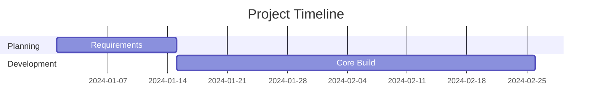
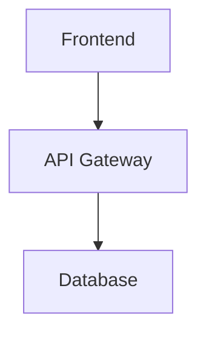
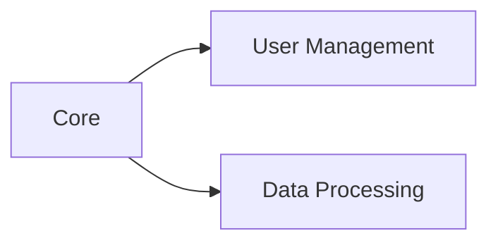

# Dual-File Generation System - Complete Implementation

## ✅ **System Overview**

Your RFP proposal generator now creates **TWO separate files** for every proposal:

1. **📄 Main Proposal Document** - Word/PDF/Excel with complete content
2. **📊 Interactive Visualization Document** - HTML with Mermaid diagrams

## 🎯 **What Users Now Receive**

### **File 1: Main Proposal Document**
- **Format**: Word (.docx) or Excel (.xlsx) for financial proposals
- **Content**: Complete proposal with all sections, content, and business information
- **Use**: Client presentation, formal submission, detailed review

### **File 2: Interactive Visualization Document**
- **Format**: HTML (.html) with embedded Mermaid.js
- **Content**: Interactive diagrams including:
  - 📅 Project timeline (Gantt charts)
  - 🏗️ System architecture diagrams
  - 🧩 Modular solution design
  - 📋 Implementation process flows
  - 📦 Deliverables structure
- **Use**: Visual presentation, stakeholder meetings, technical discussions

## 🔧 **Technical Implementation**

### **Backend Changes**

#### **1. New Visualization Generator Class**
```python
class VisualizationDocumentGenerator:
    def generate_visualization_html(self, content, structure, company_name, job_id, request)
    # Creates professional HTML with Mermaid diagrams
```

#### **2. Enhanced File Generation Process**
```python
# Generate main document
word_file = doc_generator.generate_word_document(...)
generated_files = [word_file]

# Generate visualization document (ALWAYS created)
visualization_file = visualization_generator.generate_visualization_html(...)
generated_files.append(visualization_file)
```

#### **3. Automatic Diagram Detection**
- Timeline sections → Gantt charts
- Architecture sections → System diagrams  
- Modular sections → Component relationships
- Implementation sections → Process flows
- Deliverables sections → Structure diagrams

### **Frontend Changes**

#### **1. Enhanced Download Interface**
- **Two-column layout** separating document types
- **Clear categorization** of main vs visualization documents
- **Appropriate icons** and descriptions for each type
- **User guidance** explaining what each document contains

#### **2. Smart File Recognition**
```typescript
// Main documents (not visualization)
downloadFiles.filter(filename => !filename.includes('visualization'))

// Visualization documents
downloadFiles.filter(filename => filename.includes('visualization'))
```

## 📊 **Visualization Features**

### **1. Professional HTML Layout**
- Modern, responsive design
- Professional styling with gradients
- Company branding integration
- Timestamp and metadata

### **2. Interactive Mermaid Diagrams**
- **Timeline Visualizations**:


- **Architecture Diagrams**:


- **Modular Design**:


### **3. User Experience**
- **Click to open** visualization in new tab
- **Interactive editing** via Mermaid.live integration
- **Professional presentation** suitable for client meetings

## 🎨 **Sample Output**

### **Main Document (proposal_CompanyName.docx)**
```
1. Executive Summary
2. Understanding of Requirements
3. Deliverables and Expected Outcomes
4. Pricing and Investment Structure
5. Proposed Solution and Approach
   [Detailed text content with business focus]
```

### **Visualization Document (visualization_CompanyName.html)**
```html
<!DOCTYPE html>
<html>
<head>
    <title>CompanyName - Project Visualizations</title>
    <script src="mermaid.min.js"></script>
</head>
<body>
    <div class="header">Project Visualizations</div>
    
    <div class="visualization-section">
        <h2>Project Timeline</h2>
        <div class="mermaid">
            gantt
                title Project Timeline
                [Interactive Gantt Chart]
        </div>
    </div>
    
    <div class="visualization-section">
        <h2>System Architecture</h2>
        <div class="mermaid">
            graph TD
                [Interactive Architecture Diagram]
        </div>
    </div>
</body>
</html>
```

## 💡 **Benefits for Users**

### **1. Complete Solution**
- **Main document** for formal proposal submission
- **Visualization document** for technical presentations
- **No additional tools** required

### **2. Professional Presentation**
- **Client meetings**: Use visualization document for visual impact
- **Technical reviews**: Architecture and implementation diagrams
- **Executive presentations**: Timeline and deliverables overview

### **3. Enhanced Competitiveness**
- **Visual differentiation** from text-only proposals
- **Professional appearance** with interactive elements
- **Comprehensive coverage** of both content and visuals

## 📈 **Usage Scenarios**

### **Scenario 1: Technical Proposal**
- **Main Document**: Technical approach, methodology, team qualifications
- **Visualization Document**: System architecture, implementation timeline, modular design

### **Scenario 2: Financial Proposal**
- **Main Document**: Excel with financial analysis, budget breakdowns
- **Visualization Document**: Project timeline, deliverables structure, implementation flow

### **Scenario 3: Client Presentation**
- **Use main document** for detailed review and formal submission
- **Use visualization document** in presentations and stakeholder meetings

## 🔄 **Workflow Integration**

1. **User generates proposal** through your Next.js interface
2. **System creates both files** automatically
3. **Download interface** clearly shows both document types
4. **User receives**:
   - Professional proposal document (Word/Excel)
   - Interactive visualization document (HTML)

## 🚀 **Future Enhancements**

### **Potential Additions**
- **PDF export** of visualization document
- **Custom branding** in visualization templates
- **Sector-specific** diagram templates
- **Client collaboration** features in visualization

Your proposal generator now provides a **complete dual-document solution** that combines traditional proposal content with modern interactive visualizations!