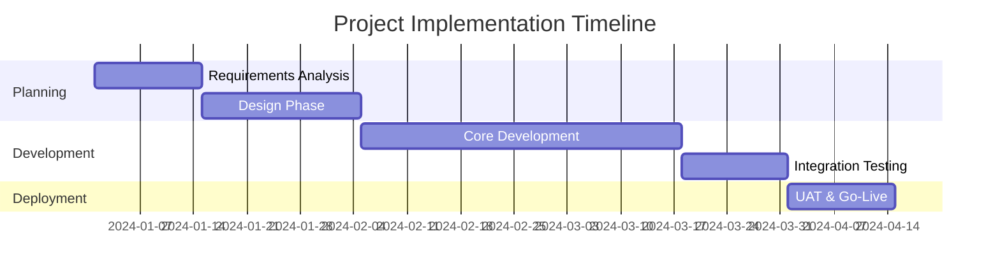
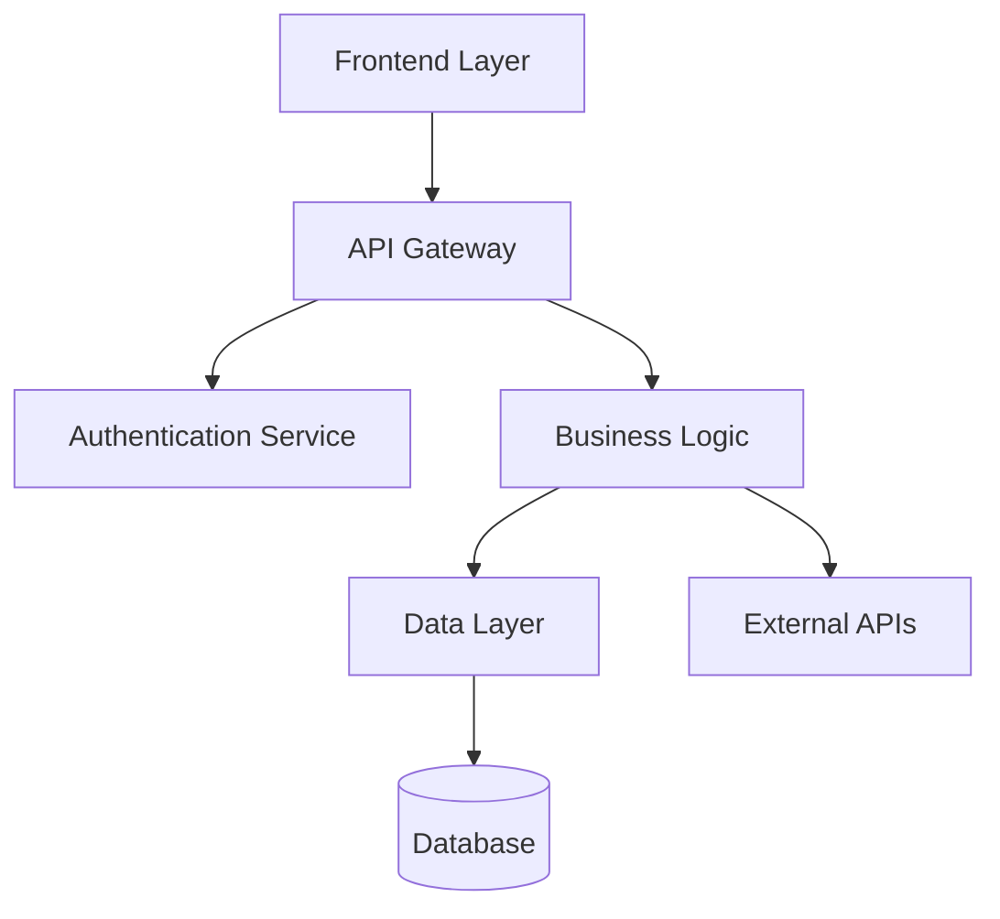
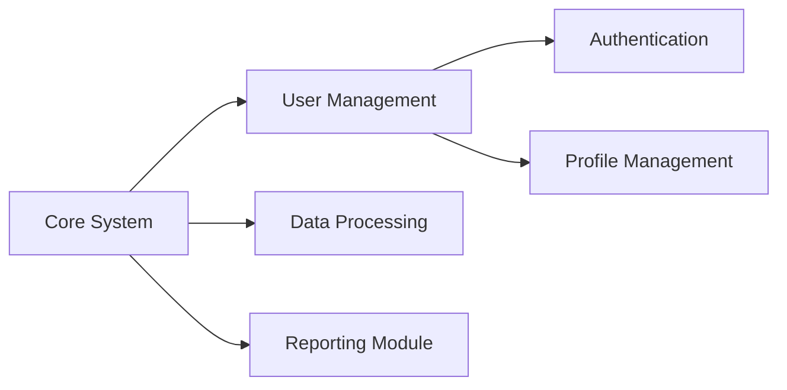

# Free Visual APIs for Professional Diagrams

## ✅ **What I've Implemented**

I've integrated **Mermaid.js** into your proposal generator - a completely free solution that creates professional diagrams from text descriptions.

### 🎯 **Mermaid.js Integration**

Your system now includes:
- **Timeline Generator**: Creates Gantt charts for project phases
- **Architecture Generator**: Creates system architecture diagrams  
- **Modular Design Generator**: Creates module relationship diagrams
- **Interactive Links**: Clickable links to edit/view diagrams

### 📊 **Example Outputs**

#### **1. Timeline Diagram**


#### **2. Architecture Diagram**


#### **3. Modular Design**


## 🚀 **Alternative Free APIs**

### **Option 1: QuickChart.io**
- **Free Tier**: 500 charts/month
- **Features**: Charts, QR codes, graphs
- **API**: `https://quickchart.io/chart`
- **Best for**: Data visualization, simple charts

```python
import requests

def generate_timeline_chart(data):
    chart_config = {
        "type": "bar",
        "data": {
            "labels": ["Phase 1", "Phase 2", "Phase 3"],
            "datasets": [{
                "label": "Timeline",
                "data": [2, 6, 2]
            }]
        }
    }
    
    url = f"https://quickchart.io/chart?c={json.dumps(chart_config)}"
    return url
```

### **Option 2: Kroki.io**
- **Free Tier**: Unlimited (self-hosted available)
- **Features**: Multiple diagram types (PlantUML, Mermaid, etc.)
- **API**: `https://kroki.io`
- **Best for**: Technical diagrams, UML

```python
import requests
import base64

def generate_plantuml_diagram(uml_code):
    encoded = base64.b64encode(uml_code.encode()).decode()
    url = f"https://kroki.io/plantuml/png/{encoded}"
    return url
```

### **Option 3: Bannerbear (Canva Alternative)**
- **Free Tier**: 30 images/month
- **Features**: Template-based image generation
- **API**: Professional templates
- **Best for**: Branded visuals, presentations

```python
# Bannerbear API example
def generate_timeline_image(project_data):
    api_key = "your_free_api_key"
    
    payload = {
        "template": "timeline_template_id",
        "modifications": [
            {"name": "project_title", "text": project_data["title"]},
            {"name": "phase_1", "text": project_data["phases"][0]}
        ]
    }
    
    response = requests.post(
        "https://api.bannerbear.com/v2/images",
        headers={"Authorization": f"Bearer {api_key}"},
        json=payload
    )
    return response.json()["image_url"]
```

## 🔧 **How to Use Your Current System**

### **1. Automatic Generation**
The AI now automatically generates Mermaid diagrams when it detects:
- Timeline sections
- Architecture sections  
- Modular design sections

### **2. Manual Generation**
You can also manually generate diagrams:

```python
# In your proposal processing
phases = [
    {"name": "Planning", "task": "Requirements", "start": "2024-01-01", "duration": "2w"},
    {"name": "Development", "task": "Core Build", "start": "2024-01-15", "duration": "6w"}
]

timeline_content = diagram_generator.generate_timeline_mermaid("Project Name", phases)
```

### **3. Integration with Proposals**
The diagrams are automatically embedded in proposals with:
- Mermaid code blocks (render in modern viewers)
- Interactive links to Mermaid.live
- Professional descriptions

## 📈 **Benefits of This Approach**

### **✅ Completely Free**
- No API keys required
- No usage limits
- No subscription fees

### **✅ Professional Quality**
- Clean, modern diagrams
- Interactive and editable
- Export to PNG/SVG/PDF

### **✅ Easy Integration**
- Text-based generation
- Works with your existing AI
- Renders in documents

### **✅ Client-Friendly**
- Clickable links for interaction
- Professional presentation
- Easy to understand visuals

## 🎯 **Next Steps**

1. **Test Current Implementation**: Generate proposals to see Mermaid diagrams
2. **Enhance with QuickChart**: Add data visualization charts
3. **Explore Bannerbear**: For branded visual templates
4. **Custom Templates**: Create sector-specific diagram templates

Your proposal generator now creates **professional visual diagrams** using free APIs - no expensive tools needed!